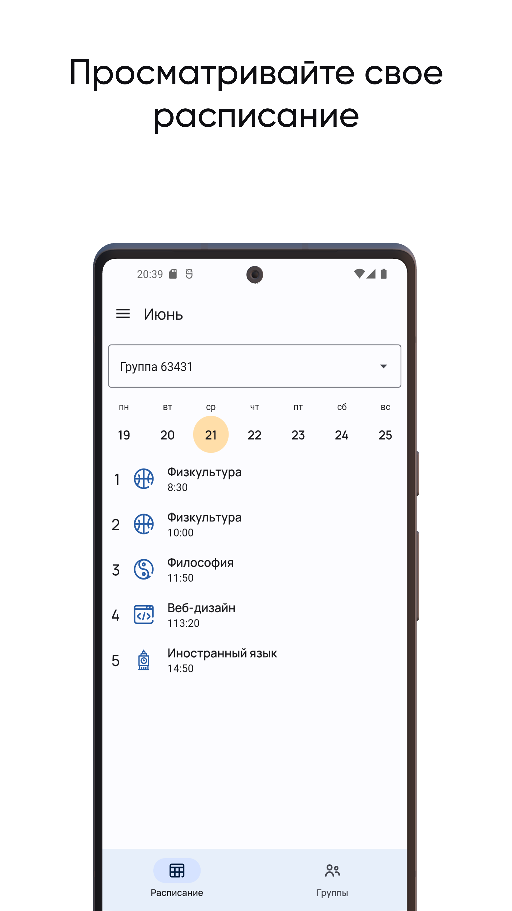
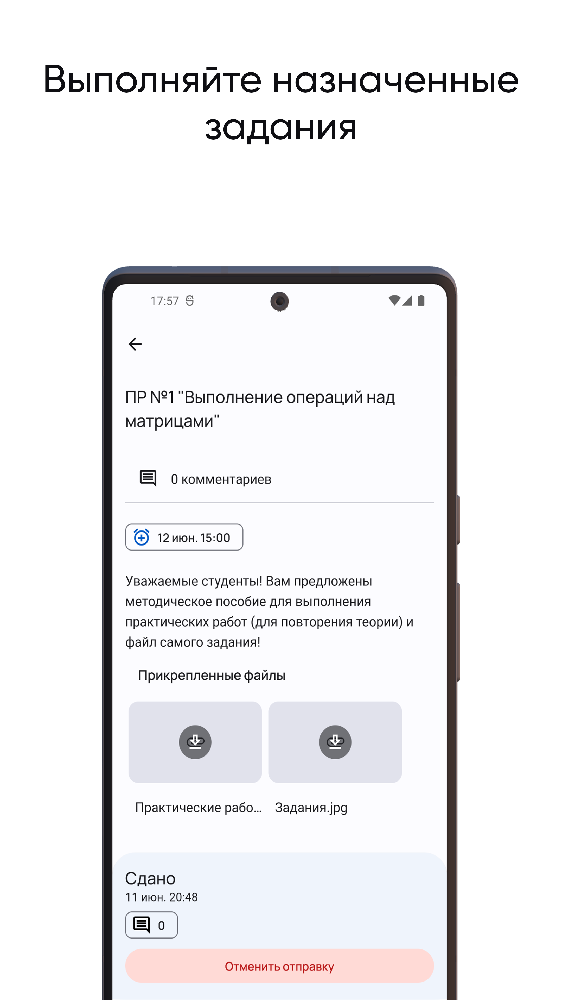
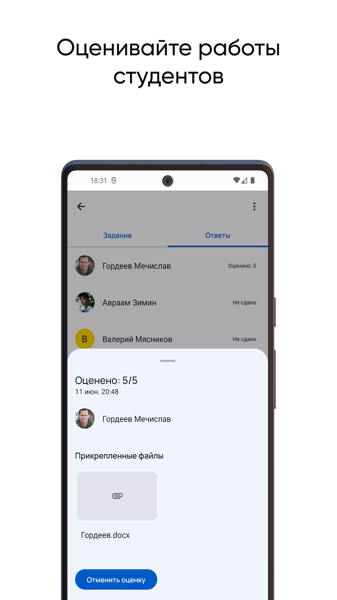
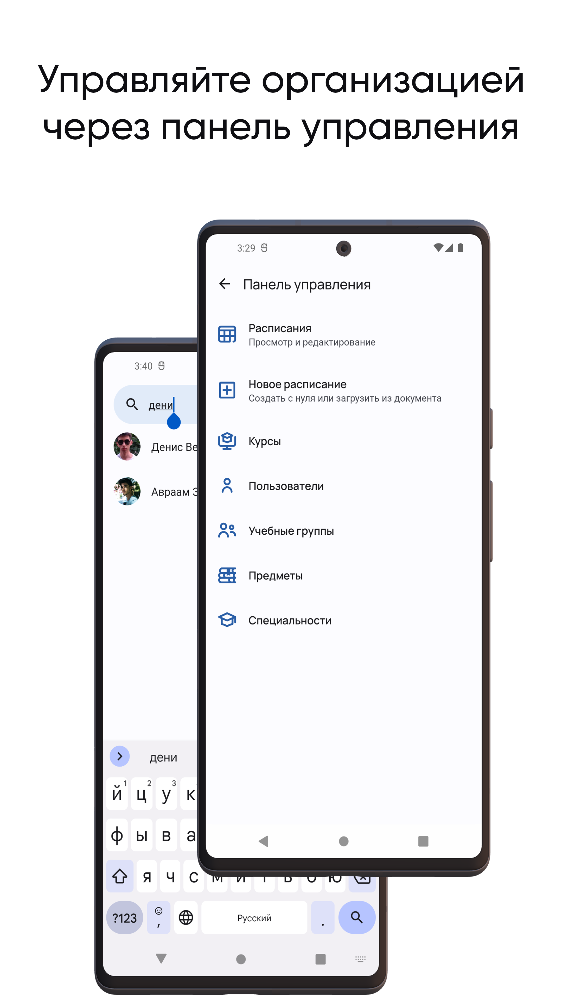

     
    <h1>Studiversity</h1>

    
    
    
    

## Скачать мобильное приложение

  

## 💡 Функции

- Ведение и просмотр расписания для студентов и преподавателей
- Работа с группами
- Ведение учебных курсов групп
- Ведение заданий в курсах
- Сдача и оценка работ
- Модерация всех участников, групп, расписаний, курсов (добавления, обновления, удаления, поиск) и т.д.

## Обзор

### Авторизация

https://github.com/denchic45/Studiversity/assets/80104523/6a9a31dc-bf88-4d4b-b6b6-3f288f95c547

### Сдача работы

https://github.com/denchic45/Studiversity/assets/80104523/01da7c35-caef-42a7-a0b7-31ea7d544a2a

### Проверка и оценивание работы

https://github.com/denchic45/Studiversity/assets/80104523/f7f1bd8a-2cdd-4639-b6be-89137abb989e

## 📋 TODO

- [x] Авторизация
- [x] Работа с группами
- [x] Просмотр расписания уроков
- [x] Парсинг документа расписания
- [x] Ведение выполнения заданий
- [x] Написание своего бэкенда (Ktor)
- [ ] **Настольная версия (Kotlin Multiplatform)**
- [ ] Чаты и видеоконференции
- [ ] Web-версия
- [ ] Управление дежурствами
- [ ] Журнал посещаемости
- [ ] Интеграции с Moodle

## 📎 Дополнительная информация

Смотреть [презентацию](https://1drv.ms/p/s!AkCEIF5jokBdhuYeBBy6EFqOFhstYA)

## Лицензия

Studiversity распространяется на условиях лицензии Apache (версия 2.0). См. [лицензию](LICENSE) для получения дополнительной
информации.