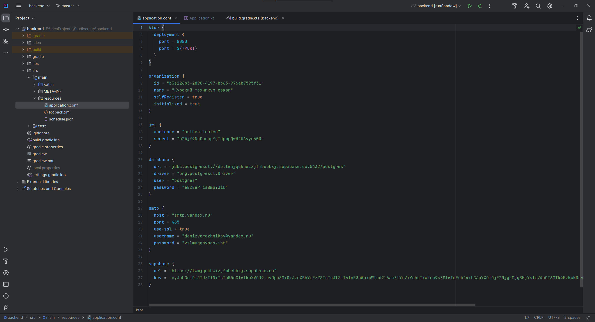
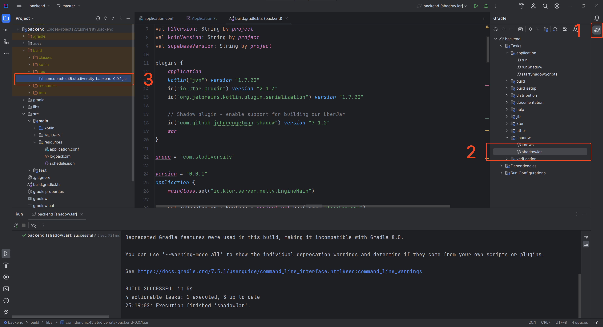

Чтобы развернуть приложение на сервере, необходимо:

1. скачать репозиторий приложения
2. открыть backend-модуль проекта через среду разработки, например IntelliJ IDEA
3. открыть файл конфигурации application.conf, имеющий следующие блоки:
    - ktor – указывается порт для развертывания
    - organization – указывается id, имя и разрешение на самостоятельную регистрацию пользователей
    - jwt – содержит данные для генерации JWT-токенов
    - database – указываются данные для подключения к базе данных
    - smtp – данные smtp-службы для рассылки писем, например: уведомление пользователя о его регистрации
    - supabase – данные для подключения к проекту Supabase для использования файлового хранилища.

Во вкладке Gradle (справа-вверху) запустите задачу shadowJar, дождитесь упаковки приложения. После окончания задачи
будет создан JAR-файл, находящийся в папке backend/build/libs. Данный файл можно развернуть, используя контейнеры
сервлетов, докер или хостинг-провайдер, который поддерживает java.

