В данном разделе Вы найдете инструкции для модерации системы,
как искать, добавлять, редактировать и удалять данные.
Чтобы открыть админ-панель, откройте боковое меню и перейдите по кнопке «Панель управления».

## Просмотр и редактирование расписаний

Выберите раздел «Расписания». Далее необходимо выбрать учебную группу,
расписание которой требуется.

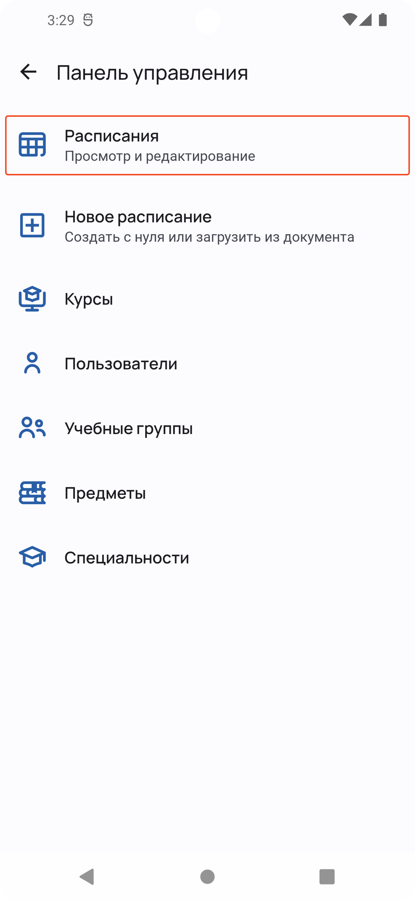{: style="max-width:220px"}
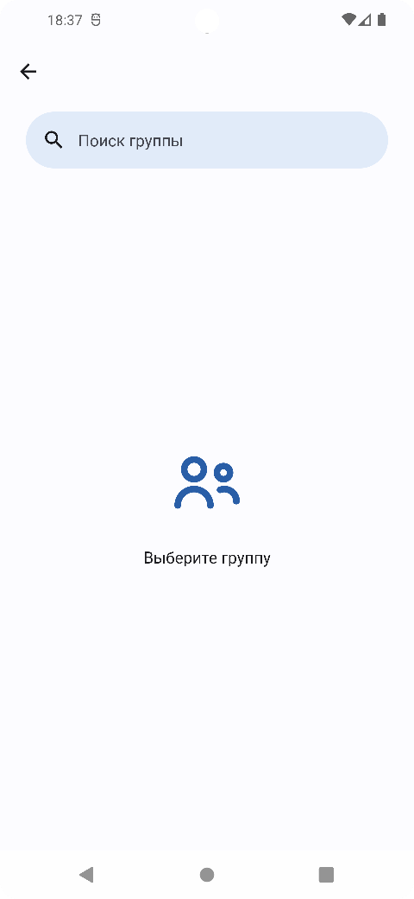{: style="max-width:220px"}
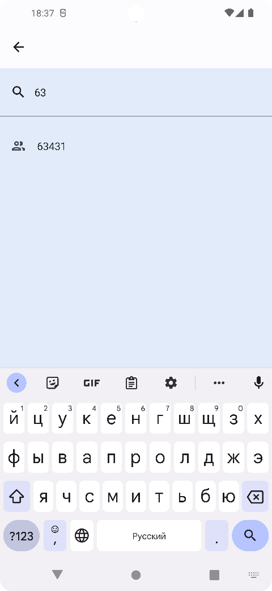{: style="max-width:220px"}

После выбора группы Вы можете просматривать ее расписание. Чтобы редактировать расписание
на определенной неделе выберите любой день недели и нажмите на иконку справа сверху,
Вы переключитесь на режим редактирования.

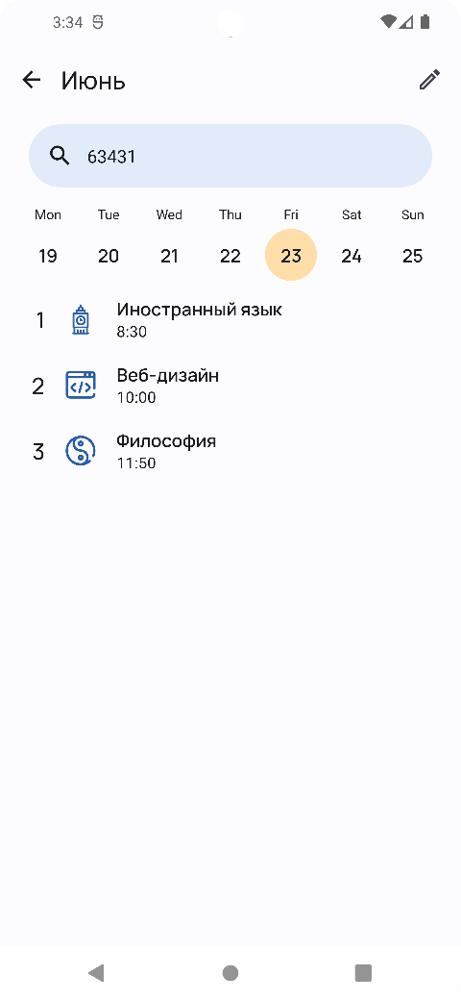{: style="max-width:280px"}
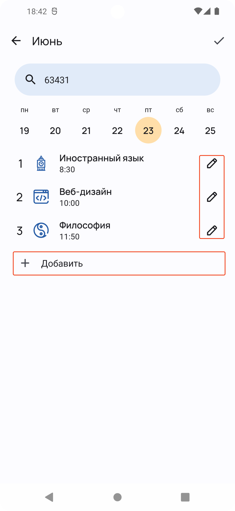{: style="max-width:280px"}

Чтобы добавить период в расписание на день, нажмите на элемент «Добавить»,
Вы перейдете на страницу редактирования периода. В верхней панели страницы
Вы можете выбрать тип периода, это может быть урок или событие.
Для создания урока необходимо заполнить необходимые поля.

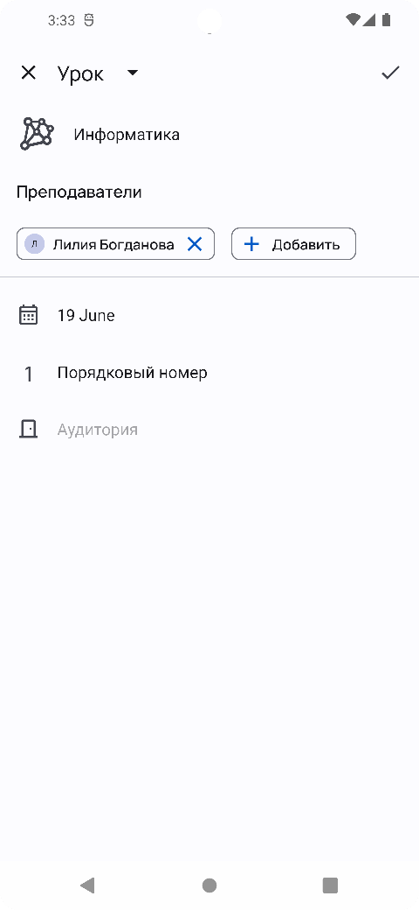{: style="max-width:280px"}

После сохранения новый урок появится в редактируемом расписании.
Чтобы редактировать период в расписании,
нажмите на иконку справа, расположенную на периоде.
Чтобы удалить период, проведите по периоду справа налево.
После внесения всех изменений нажмите на кнопку справа вверху.

## Загрузка расписания

Выберите раздел «Новое расписание». Далее необходимо выбрать способ создания расписания.

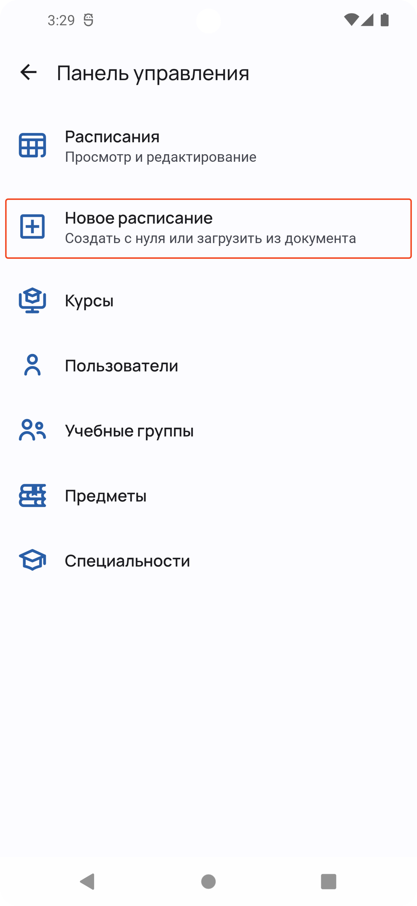{: style="max-width:280px"}
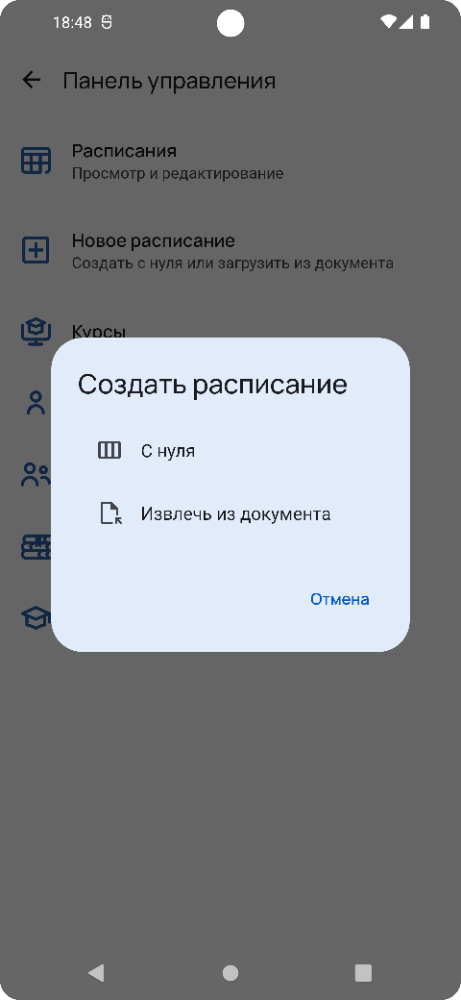{: style="max-width:280px"}

Для создания расписания с нуля выберите вариант «С нуля», после выберите дату расписания
(выбрать можно только первый день недели). Далее выберите группу,
для которой собираетесь создать расписание. Чтобы начать редактировать расписание,
включите режим редактирования. После создания расписания, нажмите «Опубликовать».

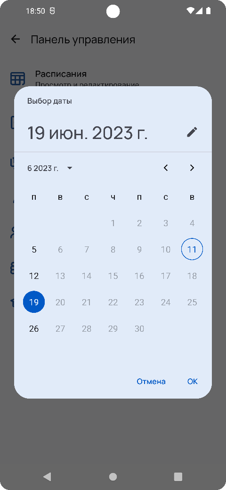{: style="max-width:220px"}
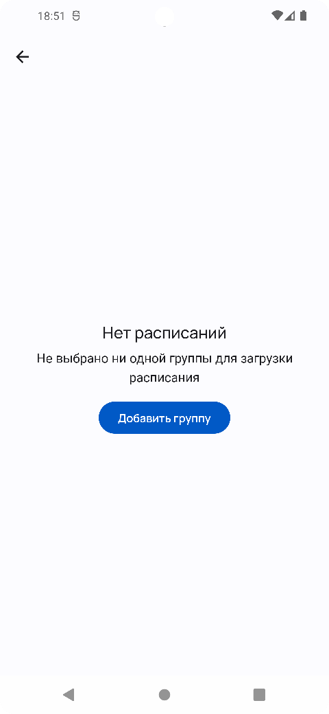{: style="max-width:220px"}
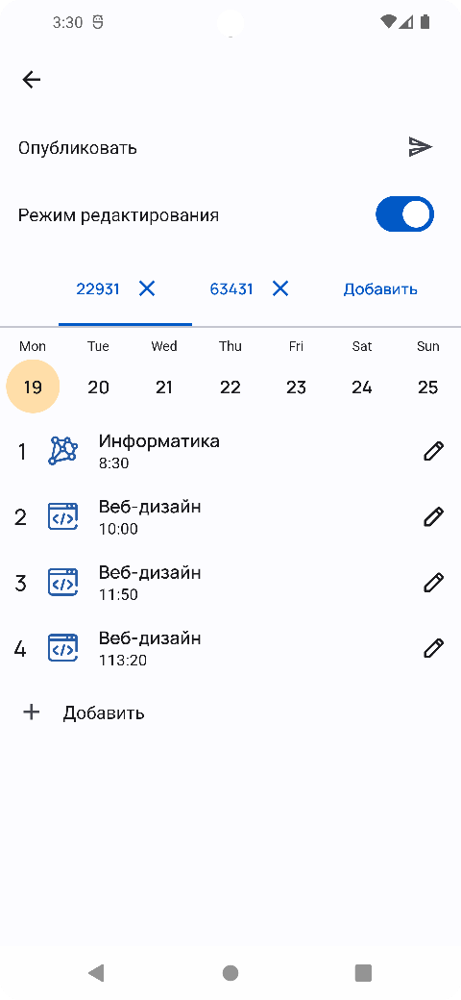{: style="max-width:220px"}

Для извлечения расписания из документа выберите вариант «Извлечь из документа»,
Вам откроется проводник для выбора документа. После выбора документа начнется извлечение расписания.
В случае возникновения ошибок при извлечении отобразится окно с сообщение с причиной ошибки,
после которой следует исправить документ, затем повторно отправить его.
При удачном извлечении расписания вы можете предварительно отредактировать его,
включив режим редактировать, и опубликовать его.

## Управление курсами

В панели управления выберите раздел «Курсы». На данной странице находится панель поиска курсов и кнопка справа внизу для
добавления новых курсов. Чтобы найти, редактировать или удалить курс, воспользуйтесь панелью поиска и выберите его из
найденных элементов. Чтобы удалить курс, его необходимо архивировать.

## Управление пользователями

В панели управления выберите раздел «Пользователи». На данной странице находится панель поиска пользователей и кнопка
справа внизу для добавления новых пользователей. Чтобы найти, редактировать или удалить пользователя, воспользуйтесь
панелью поиска и выберите его из найденных элементов

## Управление учебными группами

В панели управления выберите раздел «Учебные группы». На данной странице находится панель поиска курсов и кнопка справа
внизу для добавления новых учебных групп. Чтобы найти, редактировать или удалить учебную группу, воспользуйтесь панелью
поиска и выберите ее из найденных элементов.

## Управление предметами

В панели управления выберите раздел «Предметы». На странице курсов находится панель поиска курсов и кнопка справа внизу
для добавления новых предметов. Чтобы найти, редактировать или удалить предмет, воспользуйтесь панелью поиска и выберите
его из найденных элементов.

## Управление специальностями

В панели управления выберите раздел «Специальности». На странице курсов находится панель поиска курсов и кнопка справа
внизу для добавления новых специальностей. Чтобы найти, редактировать или удалить специальность, воспользуйтесь панелью
поиска и выберите ее из найденных элементов