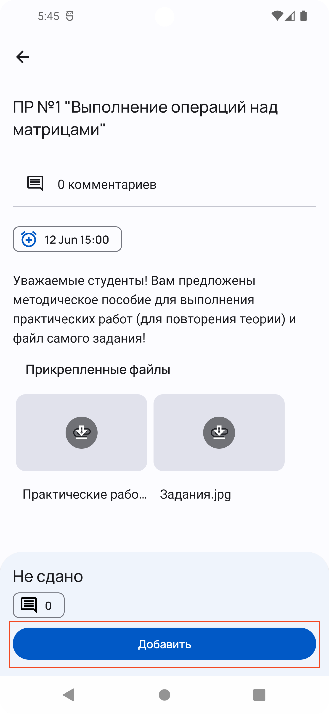
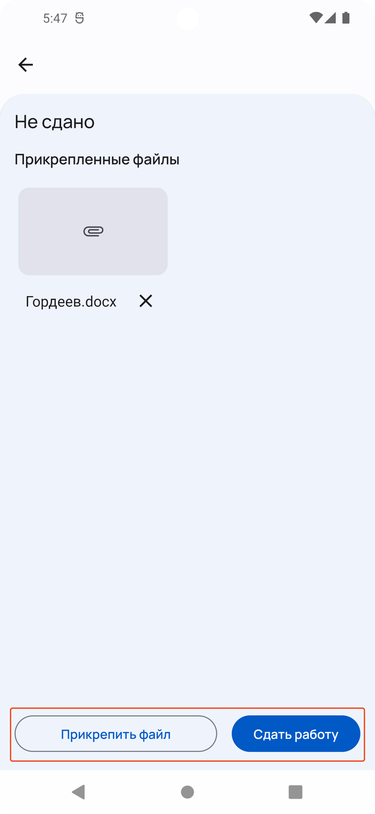
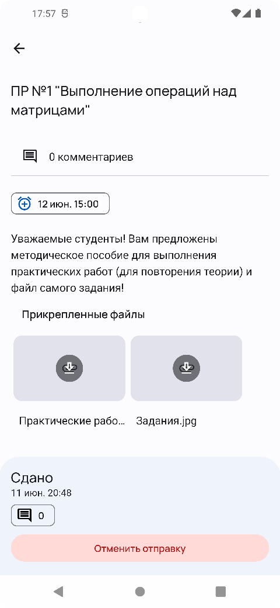

В этом разделе находятся инструкции для учащихся о том, как просматривать
назначенные задания и выполнять их.

## Просмотр заданий

Чтобы перейти на страницу с заданиями, откройте боковое меню и перейдите по кнопке «Задания».
При переходе будет доступно 3 вкладки:
- предстоящие – список заданий, которые необходимо выполнить;
- выполненные – список заданий, которые имеют сданную работу студентом;
- просроченные – список заданий с истекшим сроком сдачи.

## Сдача работы

Чтобы сдать работу, выберите задание, которое требуется сдать.
Выберите файлы, нажав на «Прикрепить», после нажмите на «Сдать»
для отправки своей работы.

{: style="max-width:280px"}
{: style="max-width:280px"}

Ожидайте проверки работы преподавателем. При необходимости, до оценки можно
отменить сдачу работы и изменить его.

{: style="max-width:280px"}